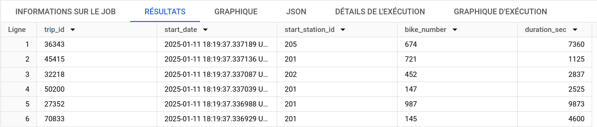
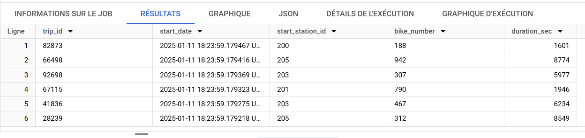

<h2 align="center">Data Streaming de trajets de vélo en libre service sur GCP</h2>

<div align="center">
  
</div>


<div align="center">
  
  
  
</div>

<h2 align="center">François Legland</h2>

## Description

L'objectif de ce mini-projet est le suivant : (i) créer un topic sur Pub/Sub, (ii) simuler un publisher sur ce topic avec un script Python, (iii) récupérer les messages ainsi générés avec Dataflow et (iv) stocker l'informations dans la solution de datawarehousing BigQuery.

## Étapes de réalisation

### 0. Se connecter avec la commande `gcloud`

```shell
gcloud config set project genial-wonder-440610-d4
```

### 1. Créer l'environnement `publisher_env`

```shell
python -m venv publisher_env
source ./publisher_env/bin/activate
pip install --upgrade pip
pip install wheel
pip install 'apache-beam[gcp]'
```
### 2. Créer le topic `bike-sharing-trips` sur PubSub

```shell
gcloud pubsub topics create bike-sharing-trips
gcloud pubsub topics describe bike-sharing-trips
```

### 3. Simuler la publication de messages sur le topic

```shell
python ./src/pubsub_publisher.py
```

### 4. Créer un abonnement au topic

```shell
gcloud pubsub subscriptions create bike-sharing-trips-subs-1 \
    --topic=bike-sharing-trips
```

### 5. Créer un dataset BigQuery dédié à la réception des messages

```shell
bq mk --dataset genial-wonder-440610-d4:rw_bikesharing
```

## 5. Lancer un job Dataflow qui exporte les messages sur BigQuery

```shell
python ./src/beam_stream_bikesharing.py \
  --project=genial-wonder-440610-d4 \
  --region=us-central1 \
  --temp_location=gs://beam_stream_bikesharing/temp \
  --runner=DataflowRunner
```

Pour informations, le script prévoit une création automatique de la table `rw_bikesharing.bike_trips_streaming` si celle-ci n'existe pas (ce qui est le cas à la première exécution).

## 6. Visualiser les données avec une requête dans BigQuery

Ensuite, afin de vérifier visuellement la bonne insertion des données dans BigQuery, nous exécutons dans sa console la requête SQL suivante :

```sql
SELECT * FROM `rw_bikesharing.bike_trips_streaming` ORDER BY
start_date DESC;
```

Sur la capture ci-dessous, nous observons alors que les données les plus récentes datent de 18h19 (cf. champ `start_date`), ce qui correpond à l'heure de début des trajets les plus récents publiés sur le topic.



En simulant de nouveau de nouveaux trajets avec `python ./src/pubsub_publisher.py `, et en regardant immédiament ensuite le contenu de notre table BigQuery, nous observons bien que les messages les plus récents y sont bien présents.



